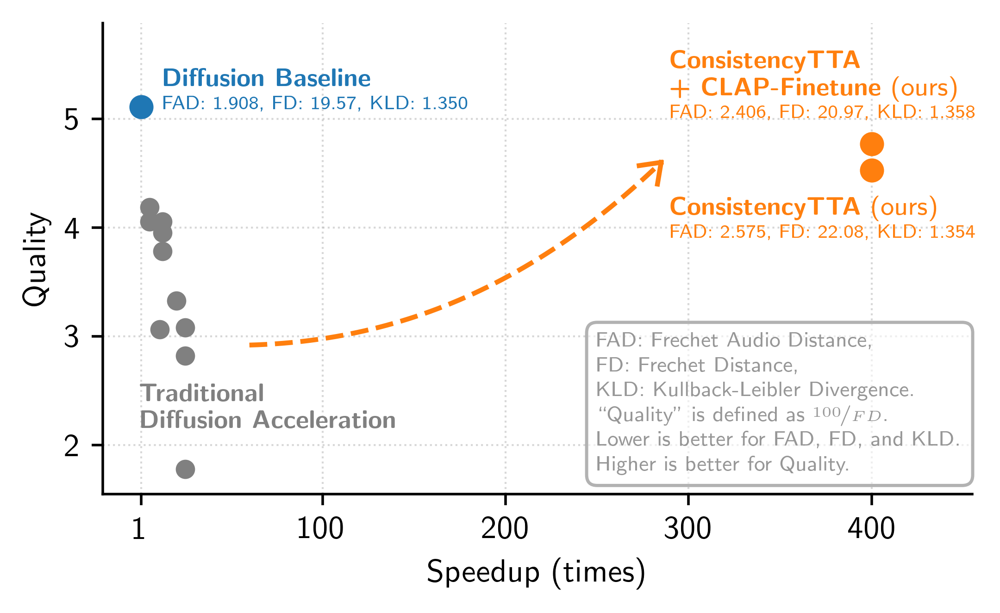

# ConsistencyTTA: Accelerating Diffusion-Based Text-to-Audio Generation with Consistency Distillation

This is the **official** code implementation for the paper \
"Accelerating Diffusion-Based Text-to-Audio Generation with Consistency Distillation" \
from Microsoft Applied Science Group and UC Berkeley \
by [Yatong Bai](https://bai-yt.github.io),
[Trung Dang](https://www.microsoft.com/applied-sciences/people/trung-dang),
[Dung Tran](https://www.microsoft.com/applied-sciences/people/dung-tran),
[Kazuhito Koishida](https://www.microsoft.com/applied-sciences/people/kazuhito-koishida),
and [Somayeh Sojoudi](https://people.eecs.berkeley.edu/~sojoudi).

**[[Preprint Paper](https://arxiv.org/abs/2309.10740)]** &nbsp;&nbsp;&nbsp;&nbsp;
**[[Project Homepage](https://consistency-tta.github.io)]** &nbsp;&nbsp;&nbsp;&nbsp;
**[[Code](https://github.com/Bai-YT/ConsistencyTTA)]** &nbsp;&nbsp;&nbsp;&nbsp;
**[[Model Checkpoints](https://huggingface.co/Bai-YT/ConsistencyTTA)]** &nbsp;&nbsp;&nbsp;&nbsp;
**[[Generation Examples](https://consistency-tta.github.io/demo.html)]**


## Description

This work proposes a *consistency distillation* framework to train text-to-audio (TTA)
generation models that only require a single neural network query,
reducing the computation of the core step of diffusion-based TTA models by a factor of 400.
By incorporating *classifier-free guidance* into the distillation framework,
our models retain diffusion models' impressive generation quality and diversity.
Furthermore, the non-recurrent differentiable structure of the consistency model allows
for end-to-end fine-tuning with novel loss functions such as the CLAP score,
further boosting performance.

<center>
  
</center>

**2024/06 Updates:**

- ConsistencyTTA has been accepted to ***INTERSPEECH 2024***! We look forward to meeting you in Kos Island.


## Getting Started

This codebase uses PyTorch as the central implementation tool, with extensive usage of HuggingFace's Accelerator package.
The required packages can be found in `environment.yml`.


### Model Checkpoints

We share three model checkpoints:
- [ConsistencyTTA directly distilled from a diffusion model](
  https://huggingface.co/Bai-YT/ConsistencyTTA/blob/main/ConsistencyTTA.zip);
- [ConsistencyTTA fine-tuned by optimizing the CLAP score](
  https://huggingface.co/Bai-YT/ConsistencyTTA/blob/main/ConsistencyTTA_CLAPFT.zip);
- [The diffusion teacher model from which ConsistencyTTA is distilled](
  https://huggingface.co/Bai-YT/ConsistencyTTA/blob/main/LightweightLDM.zip).

The first two models are capable of high-quality single-step text-to-audio generation. Generations are 10 seconds long.

These model checkpoints are available on our [Huggingface page](https://huggingface.co/Bai-YT/ConsistencyTTA).
After downloading and unzipping the files, place them in the `saved` directory.


### Dataset

ConsistencyTTA models are trained on the [AudioCaps](https://audiocaps.github.io) dataset.
Please download the dataset following the instructions on their website (we cannot share the data).

The `.json` files in the `data` directory are used for training and evaluation.
Once you have downloaded your version of the data,
you should be able to map it to our format using the file IDs provided in the `.json` files.
Please modify the file locations in the `.json` files accordingly.


## Running and Training ConsistencyTTA

### Quickstart Demo

To perform an interactive demo, where the model generates audio following user's input prompts, run the following script:
```
python demo.py --original_args saved/ConsistencyTTA/summary.jsonl \
    --model saved/ConsistencyTTA/epoch_60/pytorch_model_2.bin --use_ema
```

Some example prompts include:
- Food sizzling with some knocking and banging followed by a dog barking.
- Train diesel engine rumbling and a baby crying.


### Training

The training of our consistency model contains three distillation phases:

1. (Optional) Distill a diffusion model with adjustable guidance strength.
2. Perform the consistency distillation.
3. (Optional) Optimize the CLAP score to finetune.

The file `train.sh` contains the training script for all three stages.
The trained model checkpoints will be stored in the `/saved` directory.

The teacher model for our distilled consistency models is based on [TANGO](https://github.com/declare-lab/tango),
a state-of-the-art TTA generation framework based on latent diffusion models.

The training script should automatically download the AudioLDM weights from [here](https://zenodo.org/record/7600541/files/audioldm-s-full?download=1).
However, if the download is slow or if you face any other issues, then you can:
i) download the `audioldm-s-full` file from [here](https://huggingface.co/haoheliu/AudioLDM-S-Full/tree/main),
ii) rename it to `audioldm-s-full.ckpt`,
and iii) keep it in the `/home/user/.cache/audioldm/` directory.

For fine-tuning and evaluating with CLAP, we use [this](https://huggingface.co/lukewys/laion_clap/resolve/main/music_audioset_epoch_15_esc_90.14.pt)
CLAP model checkpoint from [this](https://github.com/LAION-AI/CLAP) repository.
After downloading, place it into the `/ckpt` directory.

On two Nvidia RTX 6000 Ada GPUs, Stage 1 (40 epochs) should take ~40 hours,
Stage 2 (60 epochs) should take ~80 hours, and Stage 3 (10 epochs) ~30 hours.


### Evaluation

To perform inference using a trained consistency model and evaluate the generated audio clips, please refer to `inference.sh`.
The generated audio clips will be stored in the `/outputs` directory.

To evaluate existing audio generations, use `evaluate_existing.py`.
An example script is in `inference.sh`.


## Main Experiment Results

Our evaluation metrics include Fréchet Audio Distance (FAD), Fréchet Distance (FD), KL Divergence, and CLAP Scores.

|                              | # queries (↓)    | CLAP<sub>T</sub> (↑) | CLAP<sub>A</sub> (↑) | FAD (↓) | FD (↓) | KLD (↓) |
|------------------------------|------------------|----------------------|---------------------|---------|--------|---------|
| Diffusion (Baseline)         | 400              | 24.57                | 72.79                   | 1.908   | 19.57  | 1.350   |
| Consistency + CLAP FT (Ours) | 1                | 24.69                | 72.54                   | 2.406   | 20.97  | 1.358   |
| Consistency (Ours)           | 1                | 22.50                | 72.30                   | 2.575   | 22.08  | 1.354   |

[This PaperWithCode benchmark](https://paperswithcode.com/sota/audio-generation-on-audiocaps) demonstrates how our single-step models
stack up against previous methods, most of which mostly require hundreds of generation steps.


## Cite Our Work (BibTeX)

```bibtex
@article{bai2023accelerating,
  title={Accelerating Diffusion-Based Text-to-Audio Generation with Consistency Distillation},
  author={Bai, Yatong and Dang, Trung and Tran, Dung and Koishida, Kazuhito and Sojoudi, Somayeh},
  journal={arXiv preprint arXiv:2309.10740},
  year={2023}
}
```


## Acknowledgement and Trademarks

**Third-Party Code.** The structure of this repository roughly follows [TANGO](https://github.com/declare-lab/tango),
which in turn heavily relies on [Diffusers](https://huggingface.co/docs/diffusers) and [AudioLDM](https://github.com/haoheliu/AudioLDM).
We made modifications in `audioldm`, `audioldm_eval`, and `diffusers` directories to for training and evaluating Consistency TTA.
We sincerely appreciate the the authors of these repositories for open-sourcing them.
Please refer to `NOTICE.md` for license information.

**Trademarks.** This project may contain trademarks or logos for projects, products, or services.
Authorized use of Microsoft trademarks or logos is subject to and must follow
[Microsoft’s Trademark & Brand Guidelines](https://www.microsoft.com/en-us/legal/intellectualproperty/trademarks/usage/general).
Use of Microsoft trademarks or logos in modified versions of this project must not cause confusion or imply Microsoft sponsorship.
Any use of third-party trademarks or logos are subject to those third-party’s policies.
